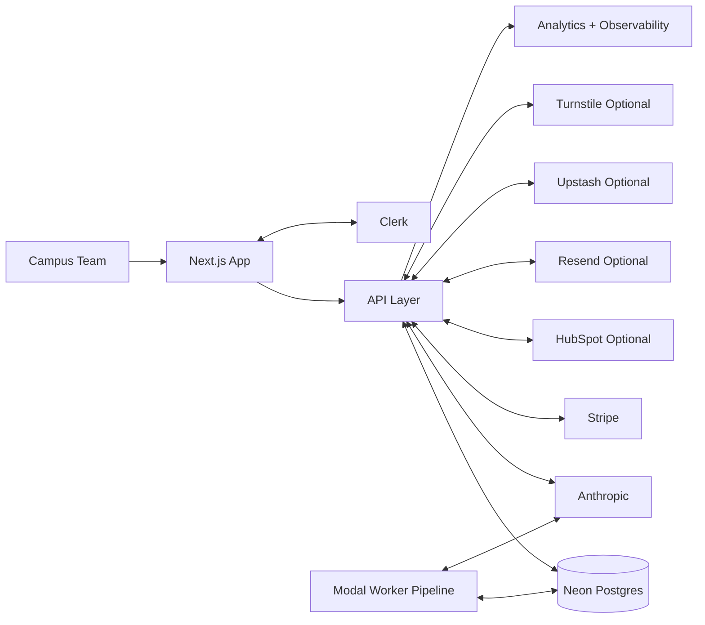

# Narrative

## One-Line Summary
Narrative is a higher-ed intelligence and response platform that helps campus teams detect emerging narratives early, prioritize risk, and coordinate action through a daily operating workflow.

## Overview
Narrative is built for higher-education teams that sit at the intersection of student experience, communications, and operations. Instead of asking teams to manually triage fragmented alerts, the platform turns public-signal noise into prioritized context, response guidance, and leadership-ready briefings.

This repo reflects a production-minded product architecture that combines:
- Public acquisition and self-serve onboarding flows
- Authenticated multi-tenant operations workflows
- AI-assisted intelligence and drafting features
- Background processing for ingestion, matching, and reporting
- Billing and lifecycle automation tied to real product usage

## Why It Matters
Campus teams often face the same operational problem: too much signal, too little coordinated context. By the time a narrative is clearly understood, it may already be shaping student, parent, and community perception.

Narrative addresses that gap by giving teams a repeatable operating cadence:
- Detect narrative movement early
- Understand likely impact and urgency quickly
- Respond with coordinated workflows instead of ad hoc thread-based decisions

The outcome is practical: faster triage, clearer ownership, and better leadership visibility.

## Product Capabilities

| Capability | User Value | High-Level System Behavior |
| --- | --- | --- |
| Multi-source monitoring | One place to track narrative movement | Background workers ingest and normalize configured sources into a shared queue |
| Campus-unit watchlists | Office-specific relevance instead of generic noise | Per-campus-unit watchlists drive matching and filtering logic |
| Narrative intelligence | Faster understanding of what matters now | Enrichment and clustering convert raw mentions into structured issue context |
| Daily briefs and alerts | Consistent executive and operator updates | Report and alert flows generate prioritized, digestible outputs |
| Response protocols | Better cross-office coordination and accountability | Workflow states support draft, assign, approve, and publish handoffs |
| AI-assisted drafting | Quicker first-pass responses and summaries | AI endpoints/workers generate summaries, support ideas, and draft guidance |
| Secure sharing | Leadership/stakeholder visibility without full product access | Expiring tokenized links enable read-only brief sharing |

## How The System Works

- Frontend and UX layer: Next.js App Router serves both marketing pages and authenticated dashboard surfaces.
- Backend/API layer: Route handlers implement tenant-aware access, role-aware mutations, billing flows, onboarding, and product operations.
- Persistence layer: Neon Postgres stores tenant state, intelligence artifacts, workflow state, and operational analytics.
- Auth and permissions: Clerk identity is combined with server-side org/client scope checks and role enforcement.
- Async/background pipeline: Modal workers handle ingestion, matching, enrichment, action/report generation, and predictive jobs.
- AI components: Anthropic is used in product workflows for summarization and draft generation.
- Deployment model: the web app/API and worker pipeline deploy independently, with separate worker environment targets.

## Technical Decisions And Design Justifications
- Unified marketing + product codebase
  - Keeps acquisition, onboarding, and product activation tightly connected.
  - Simplifies shared analytics attribution and session handling.

- Explicit multi-tenant authorization patterns
  - Access is scoped at org/client boundaries in server logic.
  - This improves clarity, auditability, and testability.

- Role-aware collaboration model
  - Viewer/editor/approver/admin roles map directly to operational responsibilities.
  - Supports controlled publishing workflows for institutional teams.

- Hybrid sync + async architecture
  - Interactive tasks stay in request/response APIs.
  - Costlier or periodic tasks move to workers for better UX responsiveness.

- Feature-flagged rollout strategy
  - Org-level feature gating enables controlled adoption of advanced modules.
  - Fail-closed behavior reduces risk from partial configuration.

- Defensive external side-effect handling
  - Idempotency, retries, and event dedupe patterns reduce duplicate actions.
  - Important for billing, CRM sync, and outbound messaging.

## Why This Product Is Credible
- Production-minded multi-tenant boundaries across protected routes and resource access
- End-to-end workflow coverage from signal detection to response execution
- Billing lifecycle engineering with webhook verification and idempotent checkout
- Async worker pipeline to isolate heavy workloads from interactive product UX
- Observability and analytics instrumentation for operational visibility
- Broad automated test coverage for authz, tenant boundaries, billing, and key workflow paths

## Key Engineering Challenges Solved
- Tenant isolation at scale across many route surfaces
- Role-based permissions across collaborative response workflows
- Background ingestion and intelligence generation without blocking UX
- Trial-to-paid lifecycle orchestration across onboarding, limits, checkout, and webhooks
- Reliability under third-party dependency failure via optional gating and graceful fallbacks
- Consistency for external side effects through idempotent patterns and dedupe controls

## Security And Privacy Approach
- Secrets are environment-managed and validated at runtime; no sensitive values are hardcoded.
- Authentication and authorization are enforced through middleware plus server-side scope checks.
- Tenant and role boundaries are applied on high-risk mutations and data access paths.
- Public submission endpoints include anti-abuse protections (rate limiting and bot controls).
- Sensitive telemetry fields are privacy-aware (hashing/redaction patterns where appropriate).
- Shared brief access is tokenized, read-only, and expiration-aware.

This README intentionally stays high-level in sensitive areas while preserving useful architectural clarity.

## Integrations
- Clerk: authentication, user identity, and session management
- Neon Postgres: primary system of record for tenant and workflow data
- Anthropic: AI-powered summarization and drafting capabilities
- Modal: asynchronous worker runtime for ingestion and intelligence jobs
- Stripe: subscription billing and lifecycle state management
- HubSpot (optional): CRM synchronization for demo/trial pipeline workflows
- Resend (optional): transactional and lifecycle messaging
- Upstash Redis (optional): durable rate limiting backend
- PostHog (optional): secondary analytics sink
- Cloudflare Turnstile (optional): bot protection on public conversion flows

## Who This Is Built For
- Campus communications teams that need early narrative awareness and faster leadership briefing
- Student affairs teams coordinating intervention decisions across offices
- Campus safety/operations teams triaging high-signal issues under time pressure
- International services teams monitoring global narratives with local student impact
- Institution leaders who need concise, decision-ready context rather than raw alert volume

## Tech Stack At A Glance
- Next.js + React + TypeScript: full-stack web foundation for product + marketing surfaces
- Tailwind CSS: fast, consistent UI development
- Clerk: auth and account/session management
- Neon serverless Postgres: relational persistence for multi-tenant product data
- Modal (Python workers): isolated asynchronous processing
- Anthropic SDK: AI features integrated into real workflows
- Stripe: subscriptions and billing lifecycle
- Vitest + Playwright: layered confidence from unit/integration to e2e

## Design Principles And Tradeoffs
- Product-first workflow design over generic dashboarding
- Clear security boundaries over implicit convenience
- Async offloading for heavy tasks to preserve product responsiveness
- Modular, optional integrations to keep core workflows resilient
- Controlled feature rollout through org-scoped flags

Tradeoff: some intelligence functions run on scheduled cadence rather than continuous streaming, balancing operational cost, complexity, and the freshness needs of daily campus workflows.

